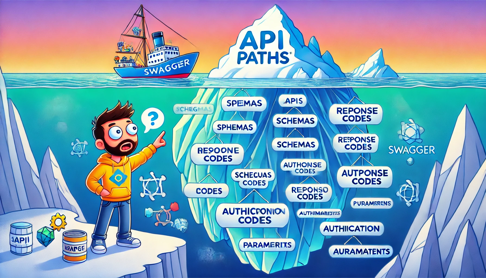
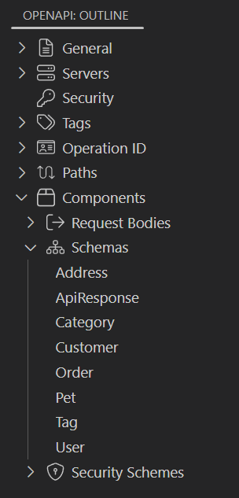
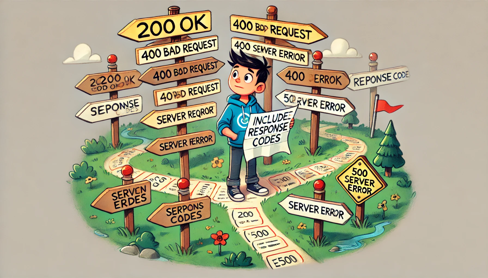

API design is more than just a checkbox on your development to-do list. Yet, too many teams treat tools like Swagger as mere documentation generators rather than powerful assets for improving API quality. From missing JSON schemas to neglecting proper response codes, sloppy API design leads to inconsistent integrations and frustrated users. If you're using Swagger just to map out your endpoints, you're doing it wrong. In this post, we'll dive into common mistakes and show you how to leverage Swagger for a robust, foolproof API design process.

<!-- truncate -->
## Here's the Tough Truth: You're Misusing Swagger

> You are just scratching the surface of Swagger

Let's be honest; many teams don't fully understand the purpose of Swagger (OpenAPI). They throw together a spec, check it off as "done," and move on. But if you're only using Swagger to document your API paths, you're barely scratching the surface of what it can do. Swagger is about setting *clear expectations*; not just for what endpoints exist, but for *how* they behave, what data is acceptable, and what responses can be expected in every scenario.  

Think about it: Are you really defining those expectations? Or are you leaving developers guessing and hoping everything will just work? That's a dangerous game to play, especially as APIs become the lifeblood of modern software.

Put end-users first. They rely on your API to work consistently, predictably, and securely. By using Swagger correctly, you can deliver an API that meets those expectations every time, hiding the complexity of your API behind a well-defined interface.

## Common Swagger Mistakes That Hurt Your API

> OpenAPI Outline

Let's get real about where things often go wrong:

### 1. Ignoring JSON Schemas

> JSON Schemas are the backbone of your API design

The schema **is the backbone** of your API design, in fact, JSON schemas are the backbone of any Object-Oriented API design. It defines what data should look like, ensuring that requests and responses follow the same structure every time. But too many teams skip this step, leaving API consumers to figure it out through trial and error. 

Imagine if every time you used an API, you had to guess the data format. That's the frustration your users feel when you don't include schemas; in continuous integration and continuous deployment (CI/CD) environments, this can lead to a lot of errors because the API consumers expects that the data will remain the same on every upgrade, but if the data structure changes, the API consumers will have to update their code to match the new data structure, with no schema definition, this can be a nightmare.

**Fix this:** Always, *always* define your request and response schemas. Swagger makes this easy, and it will save your users from headaches (and your inbox from bug reports). If your schema is complex, break it down into smaller schemas and reference them in your main schema. Include examples, too, to show what data should look like in practice.

Help the developers to understand the data structure of your API, make the developer experience (DX) as smooth as possible, and they will love your API.

### 2. Not Specifying Response Codes

> Response codes are the roadmap for your API

Another mistake? Only defining successful responses and ignoring what happens when things go wrong. APIs break. Users send bad data. You know this will happen, so why not prepare for it?

**Common problem:** Many specs only define the 200 OK response and skip 4XX or 5XX codes. What should developers do when they get a `400 Bad Request` or a `500 Internal Server` Error? Leaving this out not only makes debugging difficult but also shows that you're not thinking through the full lifecycle of your API interactions.

**Fix this:** Include detailed response codes and descriptions for all possible outcomes, not just the happy path. Doing so will allow developers to understand what went wrong and how to fix it.

### 3. Skipping Parameters and Request Bodies

You'd be surprised how often parameters are left out or poorly defined. Developers then have to reverse-engineer what an endpoint requires, which slows down development and increases the risk of errors. Even worse, some teams leave out request body details altogether. The request body is highly related to the JSON schema and you should leverage or reuse the schema definition to define the request body.

**Fix this:** Be explicit about all parameters (query, path, header, etc.) and clearly define the structure of request bodies. This transparency will make life much easier for developers consuming your API.

### 4. Forgetting Authentication Details

This is less common but still a critical mistake. APIs that handle sensitive data or require access control need to clearly define authentication mechanisms. Not specifying OAuth, API keys, or JWT in your spec means developers have to figure it out the hard way, often by trial and error.

**Fix this:** Take full advantage of Swagger's security definitions. Make sure your spec shows exactly how to authenticate and authorize requests to protect data properly.

## What Happens When You Use Swagger Correctly

</img>

Now, let's flip the script. When you use Swagger *properly*, you're not just documenting an API; you're designing a reliable, predictable service that developers can trust. Here's what happens when you get it right:

1. **Automatic Testing and Validation**  
   A well-defined Swagger spec allows for automatic testing tools to validate requests and responses against the schema. This improves your API's reliability and reduces manual testing effort.

2. **Faster API Integrations**  
   When your Swagger spec is clear and complete, developers can integrate faster. There's no need to guess at data formats or response codes. They know exactly what to send and expect, speeding up development and minimizing errors.

3. **Easier API Evolution**  
   A well-structured API design makes it easier to version and evolve over time without breaking existing integrations. Swagger gives you a blueprint for how to extend and maintain your API without chaos.

4. **Enhanced Developer Experience**  
   Developers love APIs that are easy to use and predictable. By specifying everything; schemas, responses, parameters, and authentication; you create an API that developers *want* to work with. That leads to fewer support tickets and a happier dev community.

## Challenge: Are You Ready to Rethink Your API Design?

It's time to take a hard look at how you're using Swagger. Are you just documenting paths? Are you skipping key details like schemas or response codes? If so, your API design is incomplete; and that's hurting both your team and your users.

The good news? Fixing it is easy. Swagger is an incredibly powerful tool when used correctly. By following best practices for API design; defining clear schemas, specifying all responses, including detailed parameters, and leveraging authentication; you can deliver an API that's not only functional but exceptional.

## Final Thoughts

Swagger is more than documentation; it's your key to creating a reliable, well-structured API. Don't settle for "just good enough." Push your API design to the next level by using Swagger the way it was meant to be used. By challenging yourself and your team to build APIs with precision and clarity, you'll drastically improve the developer experience, reduce errors, and create services that can scale with ease.

Are you ready to level up your API design? Let's do this.

## Dog Fooding

We are convinced that well defined Swagger OpenAPI specs are the key to a successful API design, that's why we are creating tools like [`GYAT`](/gyat) to help developers to test their APIs with ease. [`HAPI`](/hapi) is another tool that we are developing to help developers to scaffold a fully functional API server without writing any code. We are also working on the `APICove Studio Generator` to help developers to automatically generate API tests from their OpenAPI spec file. We are dogfooding our own tools to make sure that they are useful and easy to use.

 Would like to validate if your API is well defined? Try `GYAT` and let us know what you think. 🤓