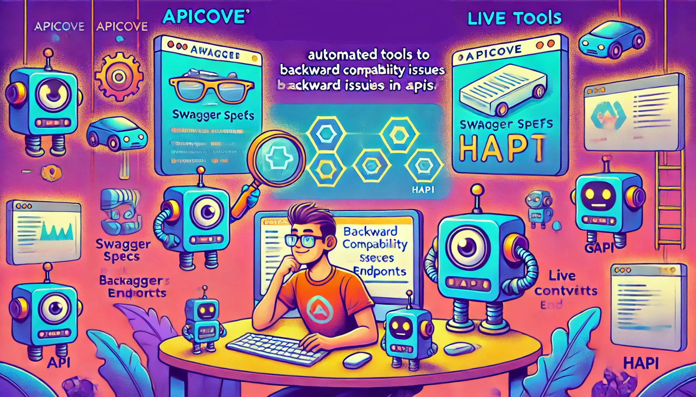
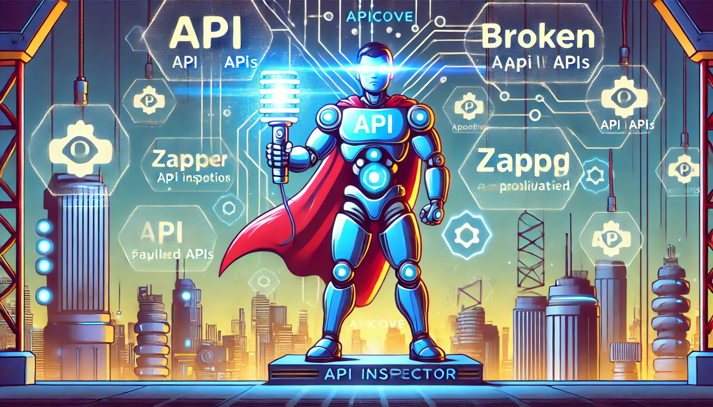
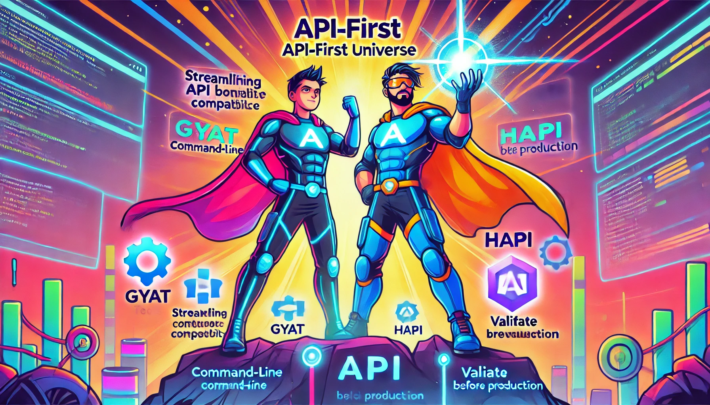

When developers integrate systems and a new API version gets released, there's often a common struggle: **figuring out what breaks**. The task of identifying backward compatibility issues can be tedious and overwhelming. Sometimes, changes in the API are buried deep within documentation - hidden away in a PowerPoint presented to a select group, a demo recorded months ago, or a lengthy PDF you never got around to reading. 

The real pain? Even after you track down all this information, a small, overlooked change could cause massive problems in your integration. It's frustrating, time-consuming, and distracting from what developers truly love to do; **write code**.

<!-- truncate -->

But here's the good news: there's a **better and easier way**, and yes, it can be **automated**! Let's dive into how you can streamline the process of detecting backward compatibility issues through **Swagger spec comparisons**, **live API testing**, and **deprecated API detectors**, so you can avoid human errors and focus on building the features that matter.


---

## The Pain of Manual API Version Comparisons

**Simplifying API Integration with Automated Compatibility Checks:** Let's start with the scenario many developers face when they have to work with a new API version. 


Here's what typically happens:

1. **Finding what changed**: You first need to know what has changed between the current API and the new release. Often, changes are sprinkled across various documents, demos, or code examples. Some of it might be in Swagger specs, but sometimes the documentation can be incomplete or even outdated. APIs grow organically, and keeping track of every change can be a nightmare. 🕵️‍♂️

2. **Missing the small stuff**: Even if you have all the focus in the world, missing a **minor change** (like a slightly modified response object or an updated status code) could cause serious problems in production. Dynamic parameters in the metadata, subtle changes in the request structure, or even a new field in the response - these small details can be the difference between a smooth integration and a broken one. 🔥

3. **Distraction from coding**: The time spent on what feels like detective work means less time on actual coding. You're stuck figuring out whether your integration will break instead of writing features that bring value to your users. And being honest, that's not why you became a developer and not what you enjoy doing. 🙅🏻‍♂️

Luckily, **automation tools** exist to tackle this problem head-on. And they all start with the **Swagger specifications**.

---

## The Power of Automated API Compatibility Checks

Automating API compatibility checks can save you time, reduce errors, and ensure a smooth integration process. By leveraging tools that compare Swagger specs, test live API behavior, and detect deprecated features, you can catch backward compatibility issues before they become showstoppers.



### Step 1: Start with Swagger/OpenAPI Specifications

If you have the Swagger (or OpenAPI) specs for both the current and new API versions, you're in luck. These specs provide a machine-readable blueprint of your API, which is the foundation for automating compatibility checks. Instead of manually reading through the docs or diffing JSON files, you can use tools that will do the heavy lifting.

Here are a few **essential tools** to help you get started:

#### 1. Swagger Diff

**[Swagger Diff](https://github.com/Sayi/swagger-diff)** is a command-line tool that compares two Swagger/OpenAPI specs and identifies any backward-breaking changes. It checks for differences in the endpoints, request parameters, response structures, and more, allowing you to see if the new API version is compatible with your existing code.

#### How to use it:
- Download the fat JAR Swagger Diff from the [GitHub releases page](https://github.com/Sayi/swagger-diff/releases).
   ```bash
   wget https://github.com/Sayi/swagger-diff/releases/download/v1.2.2/swagger-diff.jar -O swagger-diff.jar
   ```
- Run the comparison between the old and new specs and generate a report:
   ```bash
   java -jar swagger-diff.jar \
   -old http://petstore.swagger.io/v2/swagger.json \
   -new http://petstore.swagger.io/v2/swagger.json \
   -output-mode html > petstore-diff.html
   ```

<center>
<iframe width="600"
src="https://youtu.be/JeqfzHQtpJ4?autoplay=1&mute=1">
</iframe>
</center>
> Demo of Swagger Diff in action

This tool will show you detailed output about what's changed - whether endpoints were removed, parameters were altered, or responses were modified. These insights help you pinpoint potential issues before you even touch the code.

#### The Good

What I like about Swagger Diff is that it's easy to use and provides a clear, visual diff report in HTML that highlights the changes between the two specs.

#### The Bad

The caveat is that Swagger Diff is a bit outdated and doesn't support the latest OpenAPI 3.0 specs. But don't worry, there's another tool that does.

#### The Ugly

You need to have Java installed to run Swagger Diff, which might be a deal-breaker for some developers.

Docker can be used to run Swagger Diff without installing Java on your machine. Here's how you can do it:

<!-- Run the Java Fat Jar with Docker -->

```bash
docker run -f $(pwd)/workdir openjdk:19-jdk-alpine3.16 \
   -jar /workdir/swagger-diff.jar \
   -old /workdir/old-api.yaml \
   -new /workdir/new-api.yaml \
   -output-mode html > /workdir/api-diff.html
```

### 2. OpenAPI Diff

**[OpenAPI Diff](https://www.oasdiff.com)** works similarly, comparing two versions of an OpenAPI spec and highlighting differences. It's particularly useful for detecting breaking changes like missing endpoints, modified request bodies, or removed response fields.

#### How to use it:

More installation options are available on the [OpenAPI Diff GitHub page](https://github.com/tufin/oasdiff?tab=readme-ov-file#installation), including Docker. Here's how you can get started:

- Install OpenAPI Diff:
   ```bash
   curl -fsSL https://raw.githubusercontent.com/tufin/oasdiff/main/install.sh | sh
   ```
- Generate Changelog
   ```bash
   oasdiff changelog https://raw.githubusercontent.com/Tufin/oasdiff/main/data/openapi-test1.yaml https://raw.githubusercontent.com/Tufin/oasdiff/main/data/openapi-test5.yaml
   ```
- Detect Breaking Changes
   ```bash
   oasdiff diff https://raw.githubusercontent.com/Tufin/oasdiff/main/data/openapi-test1.yaml https://raw.githubusercontent.com/Tufin/oasdiff/main/data/openapi-test5.yaml
   ```
- Generate a Report in HTML
   ```bash
   oasdiff diff https://raw.githubusercontent.com/Tufin/oasdiff/main/data/openapi-test1.yaml https://raw.githubusercontent.com/Tufin/oasdiff/main/data/openapi-test5.yaml -f html > report.html

##### Demo of OpenAPI Diff


> From the [OpenAPI Diff GitHub page](https://github.com/tufin/oasdiff?tab=readme-ov-file#demo)

#### The Good

OpenAPI Diff is more up-to-date than Swagger Diff and **supports the latest OpenAPI 3.0** specs. Easy to install and use, and being a CLI tool, **it can be integrated into your CI/CD pipeline**. Also, you can use the Go package directly in your Go code.

#### The Bad

I prefer Swagger Diff's **HTML output for visual diffs**, the style of which is more appealing to me. OpenAPI Diff's output is more text-based, which might be less user-friendly for some.

#### The Ugly

It is implemeted in Go, which might be a downside if you're not familiar with the language.

### Why Use Swagger Diff or OpenAPI Diff?

Both Swagger Diff and OpenAPI Diff allow you to analyze your API's evolution without manually combing through the documentation or spec files, saving time and avoiding human error if you introduce an automated process in your workflow to compare the API versions.

Some people might say that it is better to use `diff` or `json-diff` command to compare the two files. But the problem with this approach is that it doesn't understand the structure of the OpenAPI spec and can't provide detailed insights into the changes. Swagger Diff and OpenAPI Diff, on the other hand, are **specifically designed for API specs** and provide a more meaningful comparison, and being honest, why aren't you identifying the changes in the API spec in the first place with these tools? 🤓

I know, I know - you're probably thinking, "But what about the live API? **How do I know if the behavior has changed?**" Don't worry; we'll get to that next.

---

## Step 2: Test the Live API for Behavioral Differences

Now that you know what's changed in the spec, the next step is to test whether the **live API** behaves as expected. Even if a spec looks fine on paper, the actual behavior of the API server could still differ due to bugs or unintentional changes.



To automate this, you can use tools like [**Postman**](https://www.postman.com/), [**Newman**](https://learning.postman.com/docs/collections/using-newman-cli/command-line-integration-with-newman/), or [**Dredd**](https://dredd.org/).

### 1. Postman and Newman

Postman allows you to create collections of API requests, which can be automated and tested with **Newman**, Postman's command-line runner.

#### Steps:
- First, build a [Postman collection](https://www.postman.com/collection/) of requests in Postman for both the old and new versions of the API.
- Use Newman to run these collections as part of your CI/CD pipeline:
   ```bash
   newman run your-collection.json --environment environment.json
   ```

This will automatically test the live API against the requests you've defined, ensuring the new version behaves as expected.


> 📽️ From the [Postman documentation](https://learning.postman.com/docs/collections/using-newman-cli/command-line-integration-with-newman/)

### 2. Dredd

If you want even deeper integration testing, **Dredd** is a powerful tool for comparing your Swagger/OpenAPI specs to the live API.

#### [How to use Dreed](https://dredd.org/en/latest/usage-cli.html):

- Install Dredd:
   ```bash
   npm install -g dredd
   ```
- Given you have a Swagger specs for the old and new API versions (old-api.yaml and new-api.yaml), run Dredd against the live API:
   ```bash
   dredd old-api.yaml http://your-live-api-server
   dredd new-api.yaml http://your-live-api-server
   ```

Dredd sends requests based on your Swagger specs and compares the actual responses from the API. This lets you catch behavioral inconsistencies - like a different status code or missing field in the response - that might not be apparent from the spec alone. Isn't that cool? 🤖

---

## Step 3: Automate Regression Testing

Once you have your tools in place, you can automate the entire compatibility testing process in your CI/CD pipeline. This ensures every new API version gets tested for backward compatibility **before** it reaches production.

### Recommended Workflow:
1. **Run Swagger Diff or OpenAPI Diff** to compare the old and new API specs.
2. **Use Postman/Newman or Dredd** to test live API behavior against both specs.
3. **Integrate these tests into your CI/CD pipeline** (using Jenkins, GitHub Actions, or CircleCI) to automatically detect breaking changes in every build.

---

## Step 4: Catch Deprecated Endpoints and Features

As APIs evolve, old endpoints or features are often deprecated. If your clients still rely on these, you need to know before they're completely removed in a future release. This is where **deprecated API detectors** come into play.

### Tools to Detect Deprecated APIs:

[**Pluto**](https://github.com/FairwindsOps/pluto) helps to detect deprecated APIs, but is not specific to Swagger specs or OpenAPI, **it is used for Kubernetes API versions**. It can be integrated into your workflow to continuously monitor for deprecated features, preventing unpleasant surprises down the road.

Taking this idea further, you can build your own detectors by providing a list of deprecated endpoints or features and checking them against the live API. This way, you can ensure your clients are aware of upcoming changes and have time to update their integrations. But, that's why we are here in first place, to automate this process and facilitate your client's developers life, right? 🤖

Then, how can you introduce this automation into your workflow without adding more complexity? That's where **APICove's Tools** comes in.

---


> 🦸‍♂️ From [APICove](https://apicove.com) to the API-First Universe

## Step 5: Enter APICove's GYAT  -  Streamline API Compatibility with Command-Line Power

When it comes to simplifying API compatibility checks, my team at **APICove** has taken things to the next level with our tool [**GYAT**](https://apicove.com/go-through-your-apis-tool). Think of GYAT like a CLI tool for APIs, with the simplicity and elegance of `kubectl`-like but supercharged for API compatibility testing.

### Why GYAT?
[GYAT](https://apicove.com/gyat) not only allows you to run commands in a familiar `kubectl`-like format, but it also provides **automated backward compatibility detection**. With a simple command, GYAT compares your Swagger specs (both current and new) and runs real-time checks against the live API if there are differences.

#### Example:
   ```bash
   gyat compare swagger-old.yaml swagger-new.yaml --live http://api-server
   ```

GYAT highlights potential issues, missing endpoints, changed response structures, and even subtle differences that might break your integration. You no longer need to juggle multiple tools or switch between documents - GYAT makes it all easier.

By providing an all-in-one solution, **GYAT lets developers focus on building**, not troubleshooting API mismatches.

---

## Step 6: Validate API Behavior Before Production with APICove's HAPI Tool

As if GYAT wasn't enough, we've also built [**HAPI**](https://apicove.com/hapi) - another tool in the APICove arsenal designed to simplify API development and ensure smooth integrations.

By design, HAPI not only helps you **validate API behavior** but also **simulate real-world scenarios** to catch issues early in the development process. HAPI allows developers to **run a real server** and the data model based on Swagger specs. This way, you can **simulate API behavior**, replicate edge cases, with real data, and catch inconsistencies **before** they become production nightmares.

#### How HAPI Works:
- Generate the server directly from your Swagger spec:
   ```bash
   hapi run swagger-new.yaml --server=https://localhost:8443 --database=edgedb://localhost:5656
   ```
- Test your applications against the production replica server to ensure everything behaves as expected. Yes, you can use GYAT to do the testing as well.
  
HAPI helps you **avoid costly mistakes** by letting you see how your API will respond, letting you refine your implementation before it hits production. It's like having a crystal ball for API development - you can see the issues before they become blockers.

### Why You Need to Try GYAT and HAPI
By incorporating [**GYAT**](https://apicove.com/gyat) and [**HAPI**](https://apicove.com/hapi) into your workflow, you're not just using another tool - you're making your life as a developer dramatically easier. API compatibility and behavioral consistency are two of the biggest headaches in agile development, but with these tools, you can tackle them effortlessly.

**Curious to see how they work?** Try them today at [**APICove**](https://apicove.com/) and see how they transform your approach to API development and testing. You'll wonder how you ever managed without them! 🚀

---

## Wrapping Up: Improving Developer Experience with Automation

No more days of tedious manual searches through PDFs and outdated docs. With the right tools, you can automate backward compatibility detection and behavioral testing to **save time**, **reduce errors**, and **focus on what matters** - coding.

Whether you're using **Swagger Diff**, **Postman**, **Dredd**, or stepping up your game with **APICove's GYAT and HAPI**, these tools will make sure your integrations are smooth and error-free. Give them a try, and let your automation do the hard work for you!

Now, go back to what you love - writing code and building amazing features. Let the tools handle the rest. 🤖🛠️

Go Rebels! ✊🏻